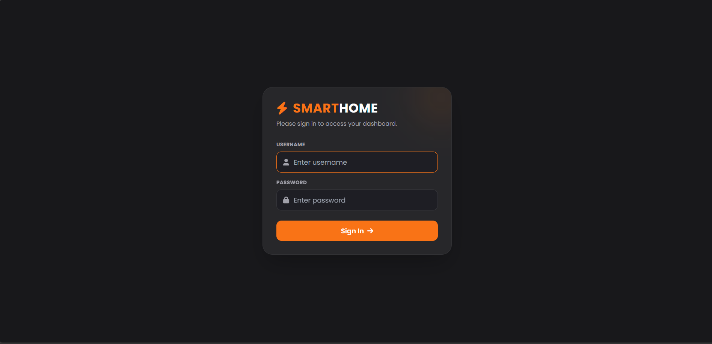
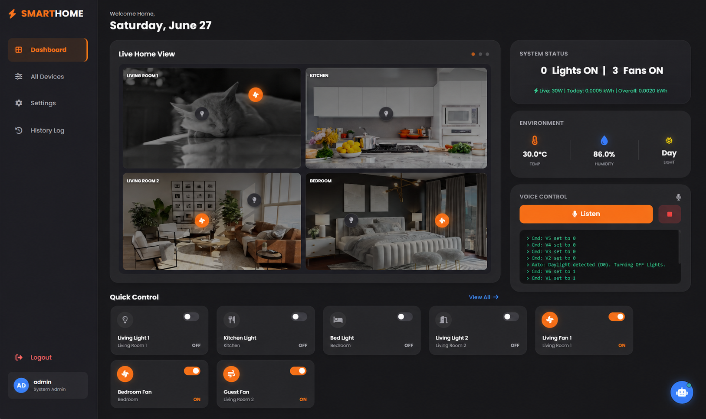

# Home Automation System

An IoT-based smart home system built with ESP32, Blynk Cloud, and a local PHP/MySQL web dashboard. Control lights and fans remotely, automate them based on temperature and light levels, track energy usage, and get notified via Telegram when devices change state.

---

## Screenshots

| Login | Dashboard |
|---|---|
|  |  |

---

## Features

### Device Control
- 7 relay outputs — 4 lights and 3 fans controllable via Blynk app or web dashboard
- Master toggle to turn all devices on or off at once
- Real-time state sync between Blynk and the local web dashboard

### Automation
- **Temperature automation** — DHT22 reads temperature every 5 seconds; all fans turn on automatically when temp hits ≥30°C and turn off when it drops back down
- **Light automation** — LDR sensor detects ambient light; all lights turn on at night and off when daylight returns

### Notifications
- Telegram bot sends a message every time a device changes state (e.g. "Light 1 → ON")
- Periodic summary sent every 30 minutes if any device is still on

### Web Dashboard
- Login-protected local dashboard (bcrypt password auth via PHP session)
- Live Home View — visual room cards showing which rooms have active devices
- Quick Control panel — toggle switches for all 7 devices from the main dashboard
- System status panel — live count of lights/fans on, current power draw, and energy totals
- Environment panel — real-time temperature, humidity, and day/night status from sensors
- Voice control — browser-based voice commands to control devices hands-free
- Energy consumption chart (today, last 7 days, last 30 days, lifetime)
- Activity history log — last 100 state changes with timestamps
- Built-in chatbot for querying power stats conversationally

---

## Tech Stack

| Layer | Technology |
|---|---|
| Microcontroller | ESP32 |
| Cloud control | Blynk IoT |
| Sensors | DHT22 (temp/humidity), LDR (light level) |
| Relays | 7-channel relay module (active LOW) |
| Notifications | Telegram Bot API (`UniversalTelegramBot`) |
| Backend | PHP + MySQL (XAMPP) |
| Frontend | HTML + Tailwind CSS + Vanilla JS |

---

## Project Structure

```
HOME_AUTOMATION/
├── firmware/
│   └── Home_auto.ino       # ESP32 sketch — relay control, DHT22, LDR, Blynk, Telegram
├── frontend/
│   ├── index.html          # Web dashboard
│   ├── css/
│   │   └── style.css       # Custom styles
│   └── js/
│       ├── tailwind.config.js
│       └── main.js         # Dashboard logic — login, device control, energy charts, chatbot
├── php/
│   └── api.php             # Backend API — auth, Blynk emulation, energy log, history
├── sql/
│   └── smarthome_db.sql    # DB schema + seed data
└── README.md
```

---

## Database Schema

- **devices** — stores current state of each virtual pin (V0–V9), including relay outputs and sensor readings
- **device_history** — logs every ON/OFF state change with timestamp (only logs when state actually changes, no spam)
- **energy_log** — per-minute energy consumption records for charting
- **users** — dashboard login credentials (bcrypt hashed)

Default devices seeded:

| Pin | Name | Type |
|---|---|---|
| V0 | Living Fan 1 | Relay |
| V1 | Bedroom Fan | Relay |
| V2 | Living Light 1 | Relay |
| V3 | Kitchen Light | Relay |
| V4 | Bed Light | Relay |
| V5 | Living Light 2 | Relay |
| V6 | Guest Fan | Relay |
| V7 | Temperature | Sensor (read-only) |
| V8 | Humidity | Sensor (read-only) |
| V9 | LDR Value | Sensor (read-only) |

---

## Setup

### 1. Database
- Import `sql/smarthome_db.sql` in phpMyAdmin
- Database name: `smarthome_db`
- Default admin account is seeded via `smarthome_db.sql` — update the password hash in the `users` table before deploying

### 2. Web Files
- Place `frontend/` and `php/` folders into `htdocs/home_automation/`
- Access at: `http://localhost/home_automation/index.html`

### 3. ESP32 Firmware
- Open `firmware/Home_auto.ino` in Arduino IDE
- Install required libraries:
  - `Blynk`
  - `UniversalTelegramBot`
  - `DHT sensor library`
  - `Adafruit Unified Sensor`
- Fill in your credentials:

```cpp
#define BLYNK_AUTH_TOKEN "YOUR_BLYNK_AUTH_TOKEN"
char ssid[] = "YOUR_WIFI_SSID";
char pass[] = "YOUR_WIFI_PASSWORD";
#define BOT_TOKEN "YOUR_TELEGRAM_BOT_TOKEN"
#define CHAT_ID   "YOUR_TELEGRAM_CHAT_ID"
```

| Placeholder | Where to get it |
|---|---|
| `BLYNK_AUTH_TOKEN` | Blynk Console → Device Info |
| `WIFI_SSID / WIFI_PASSWORD` | Your router credentials |
| `BOT_TOKEN` | @BotFather on Telegram |
| `CHAT_ID` | Your Telegram chat/user ID |

- Flash to ESP32, open Serial Monitor at 115200 baud to confirm connection

---

## How the Automation Works

The ESP32 checks sensors every 5 seconds. Each automation only triggers **once** when the threshold is crossed — it won't keep sending commands repeatedly while the condition holds:

- `isHot` flag → fans turn on when temp ≥30°C, turn off when it drops below. Only triggers on the transition.
- `isNight` flag → lights turn on when LDR value exceeds the threshold (dark), lights turn off when daylight returns. Only triggers on the transition.

This prevents spamming Blynk with redundant commands and keeps Telegram notifications clean.

---

## About This Project

Built as a personal IoT project combining hardware control, cloud connectivity, and a local web dashboard. The focus was on making automation reliable — sensors check on a fixed interval, state changes are logged only when something actually changes, and notifications are sent only when meaningful events happen.

---

## Author

**Julfahad** — Freelance Developer | Embedded Systems + Web
